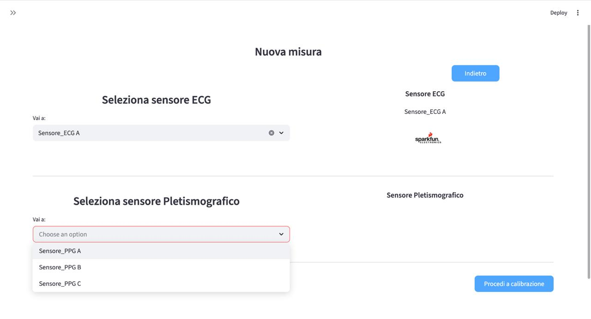
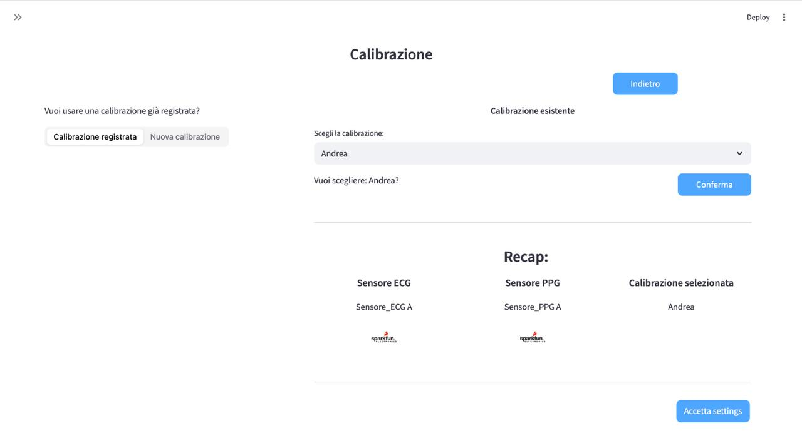
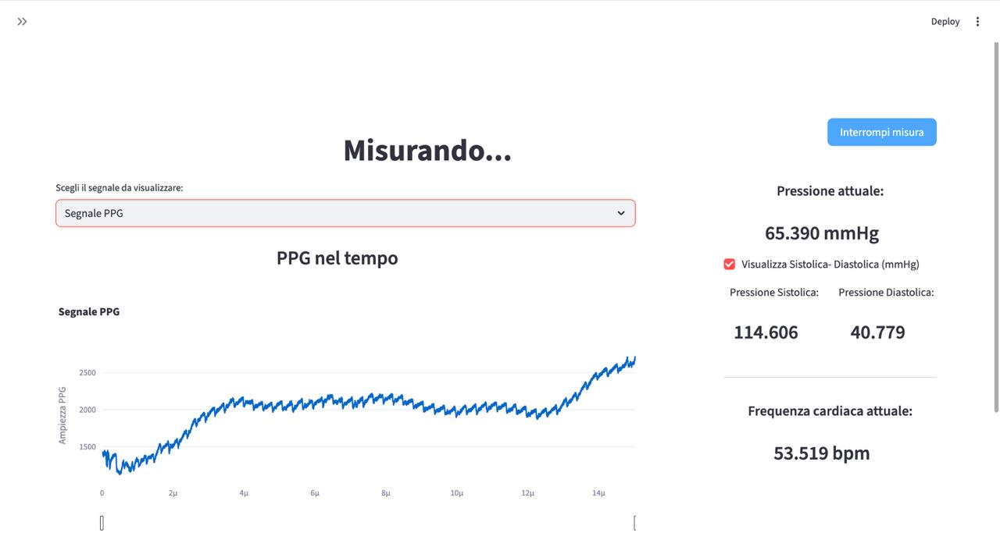
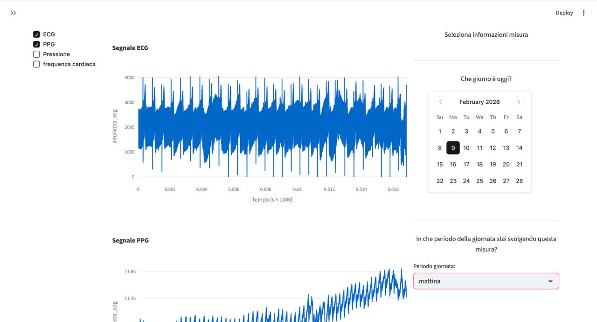
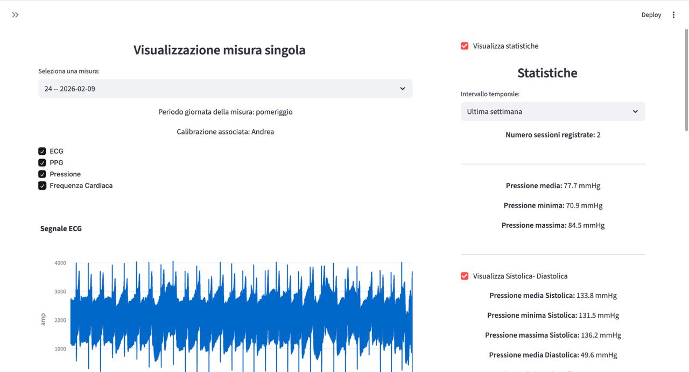
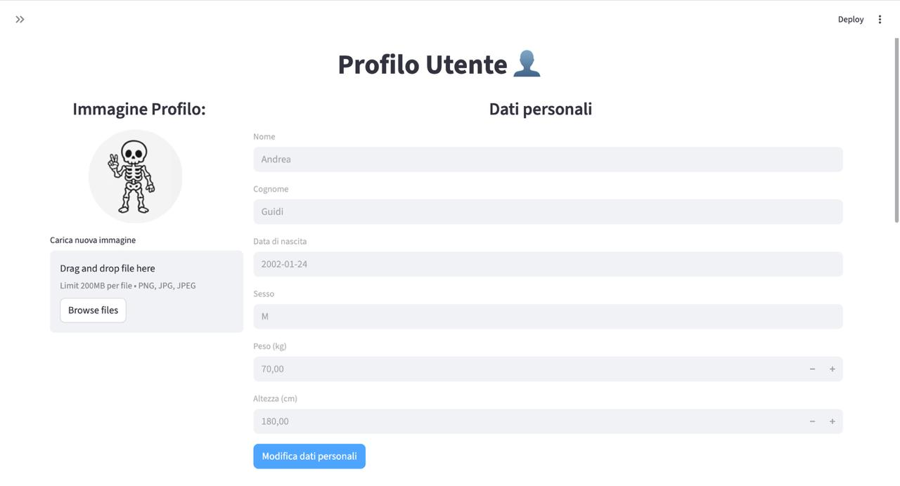

# lteb_PATproject

System for estimating **Pulse Arrival Time (PAT)** and blood pressure from **ECG** and **PPG** signals acquired in real time from two Arduino devices (nRF52840) via Bluetooth Low Energy, with a Streamlit graphical interface for user management, calibration, measurement acquisition, and history visualization.

Project developed for the Electronics and Biosensors Laboratory course (Politecnico di Milano) — Group 3.

<p align="center">
  
</p>

## Project structure

```
lteb_PATproject/
├── interfaccia.py             # Streamlit app: login/registration, calibration,
│                               # measurement acquisition, history, chart visualization
├── programma_background.py    # Support script: BLE connection, acquisition and
│                               # pre-processing of ECG/PPG signals (scipy/numpy)
├── sinc4ECG.ino                # Arduino firmware (nRF52840) for the ECG module (AD8232)
├── sinc4PPG.ino                # Arduino firmware (nRF52840) for the PPG module (MAX3010x)
├── requirements.txt            # Python dependencies
├── Report/                     # Project report (PDF + LaTeX sources and images)
└── users.db                    # SQLite database (created/updated automatically on first run)
```

## Hardware

- 2x Arduino nRF52840 boards (BLE communication via UART service, `bluefruit` library)
- ECG module based on AD8232, sampling at 512 Hz
- PPG module based on SparkFun Bio Sensor Hub (MAX3010x), sampling at 256 Hz
- SparkFun RV8803 RTC on both modules for time synchronization

The firmware files (`sinc4ECG.ino`, `sinc4PPG.ino`) must be uploaded to the respective boards via the Arduino IDE, with the `Adafruit_nRF52 (bluefruit)`, `SparkFun_RV8803`, and `SparkFun_Bio_Sensor_Hub_Library` libraries installed.

## Architecture

Block diagram of the two acquisition units (ECG and PPG) and their connection to the external processing computer:

<p align="center">
  
</p>

Detailed hardware schema, from electrodes/photodiode through the analog front-end to the microcontrollers:

<p align="center">
  
</p>

Firmware main loop (buffer handling and BLE packet transmission):

<p align="center">
  
</p>

## Software requirements

- Python 3.10 or higher (developed and tested with Python 3.12)
- Python dependencies are listed in `requirements.txt`

### Installation

We recommend working in a dedicated virtual environment:

```bash
python3 -m venv venv
source venv/bin/activate      # on Windows: venv\Scripts\activate

pip install -r requirements.txt
```

> **Bluetooth note:** the `bleak` library requires Bluetooth to be enabled on the computer. No additional configuration is needed on Windows; on macOS make sure Bluetooth permissions have been granted to the terminal/IDE; on Linux, BlueZ is generally required.

## Running the interface

With the virtual environment active, from the project folder run:

```bash
streamlit run interfaccia.py
```

The application opens automatically in the browser (by default at `http://localhost:8501`). On first launch, the `users.db` file is created automatically with the required schema (users, devices, calibrations, measurements, samples).

The intended application flow is:
1. User registration / login
2. Selecting or performing a calibration
3. Powering on and establishing BLE connection with the two devices (ECG and PPG)
4. Acquiring a new real-time measurement
5. Saving the measurement with its metadata (date, time of day) and reviewing it in the history

### App preview

**New Measurement** — choose the ECG and PPG sensors to connect to:

<p align="center">
  
</p>

**Calibration** — reuse an existing calibration profile or create a new one:

<p align="center">
  
</p>

**Measuring...** — real-time PPG signal and current blood pressure / heart rate readings:

<p align="center">
  
</p>

**Select Measurement Info** — browse past measurements by date and time of day:

<p align="center">
  
</p>

**Single Measurement View** — ECG/PPG signals alongside pressure and heart rate statistics:

<p align="center">
  
</p>

**User Profile** — personal data used for calibration (weight, height, etc.):

<p align="center">
  
</p>

## Report

The complete project report (methodology, circuit diagrams, signal processing, results) is available in `Report/Gruppo_3_Laboratorio_di_Elettronica_e_Biosensori.pdf`, with LaTeX sources in the folder of the same name.

## Notes

- `requirements.txt` was reconstructed from the imports actually present in the code (`interfaccia.py`, `programma_background.py`), since it had not been generated during development. Check the installed versions with `pip freeze > requirements-lock.txt` if you want to freeze the exact environment used for testing.
- The `users.db` file contains personal user data (including bcrypt-hashed passwords) and is correctly excluded from the repository — see `.gitignore`.
